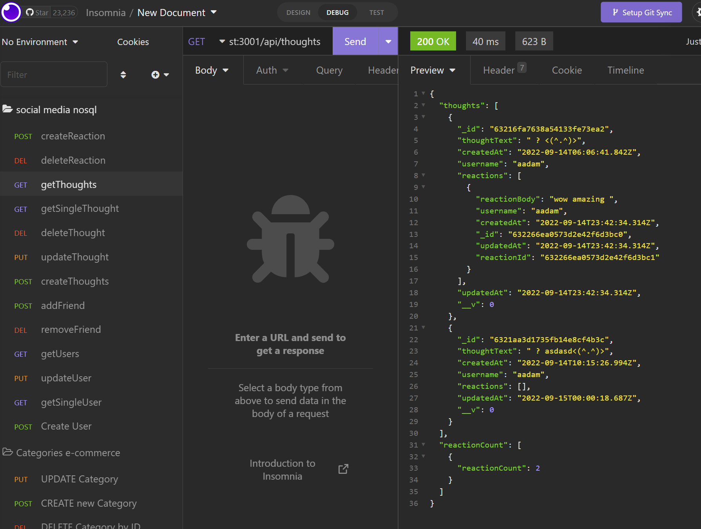

# 18-NoSQL-Social-Network-API

## Description

MongoDB is a popular choice for many social networks due to its speed with large amounts of data and flexibility with unstructured data. an API for a social network web application where users can share their thoughts, react to friends’ thoughts, and create a friend list.

## User Setup:

To use this at home, in your terminal run the following commands to invoke the application: `npm i` to install packages, then `npm run start` starts the live server.

## User story:

AS A social media startup
I WANT an API for my social network that uses a NoSQL database
SO THAT my website can handle large amounts of unstructured data

## Screenshots:

## Links:

- GitHub: https://github.com/NessJade96/18-NoSQL-Social-Network-API
- Walkthrough video: https://drive.google.com/file/d/1PHb1SMfIqhY14i3qDKqA4J9a5DNpTGvG/view

## planning notes:

1. Read through the assignment instructions and create the MVC folder structure.
   - set up package json and user setup instructions on starting application.
   - following the online guide provided to set up and link models (Users, Thoughts, Reactions) and API routes (GET, POST, PUT, DELETE).
   - check out the bonus questions and implement if given time
   - ensure all criteria is complete before filming the walkthrough video.

## Commit notes:

1. Read through all planning documentation, set up file structure and begin planning notes. Created User model, with some links to userController established.

2. Thoughts and User models, routes and controllers created.

3. Reactions schema(model) created

4. Added the reaciton api requests to the thought controllers. Additionally I pushed the thought id to the user when a user creates a thought.

5. Created the add and remove friends from the user controller, removed seed data that isnt required. api/users and api/thoughts base routes are working in insomnia

6. Went through all the API route requirements and ensured they were all working, ensuring all critira is met. I ran into a small problem with my reactions schema - I didnt import that into the Thought model which was causing problems for me. Once this was sorted, I was able to make the thought reactions api calls to create and delete.

Thank you :)
By Vanessa
